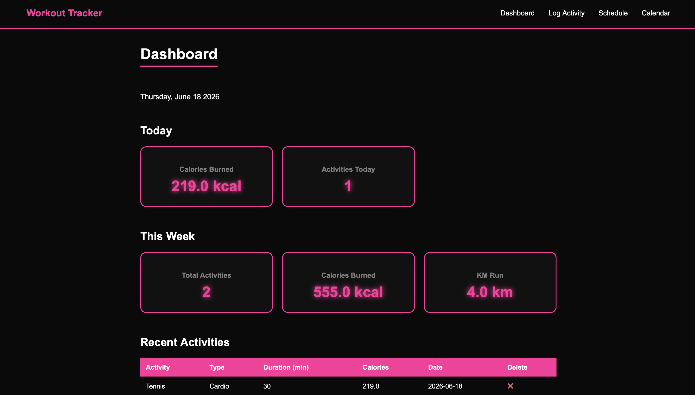
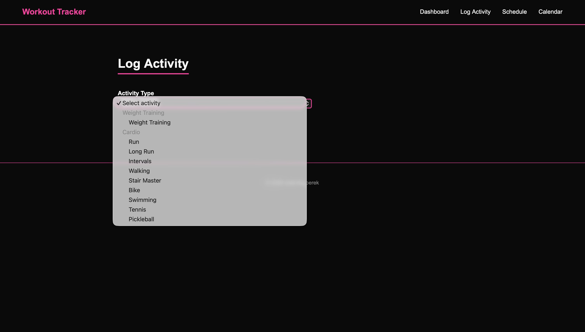
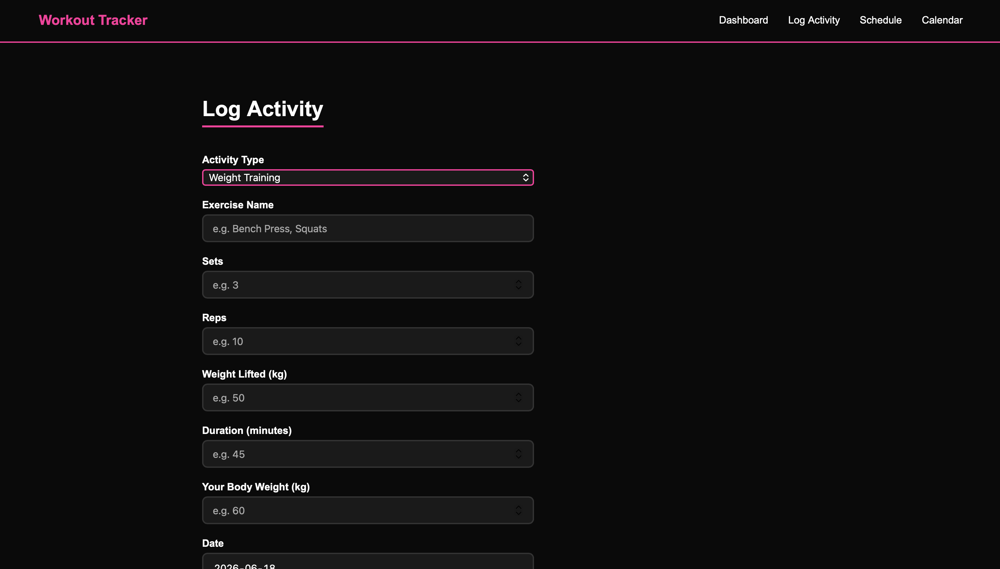
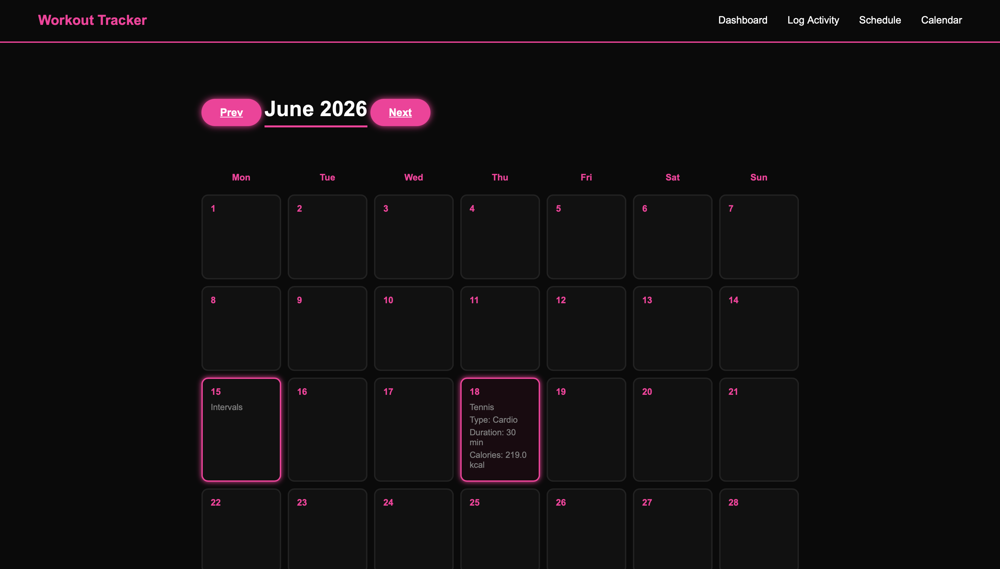
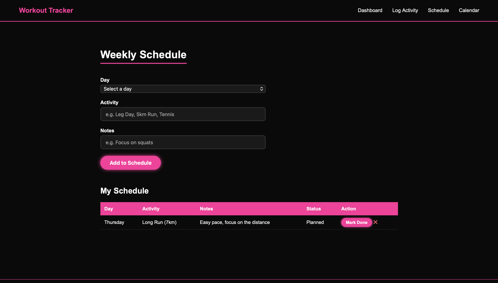

# Workout Tracker
 
A full stack workout tracking web application built with Python, Flask, and MySQL.
 
## Live Demo
Run locally — see setup instructions below.
 
## Features
- Log gym workouts with exercise name, sets, reps, weight lifted, and duration
- Log cardio activities including runs, intervals, long runs, tennis, swimming, pickleball, stair master, bike, and walking
- Accurate calorie estimation using MET formula tailored to each activity type
- Daily calorie tracking that resets each day
- Weekly summary stats including total activities, calories burned, and km run
- Interactive calendar view showing workouts by day with expandable details
- Weekly schedule planner with the ability to mark workouts complete or delete them
## Screenshots
 
### Dashboard
Real-time stats showing today's calories burned and activity count, plus a weekly summary of total activities, calories, and km run.

 
### Log Activity — Activity Selection
A single unified form with a dropdown to select any activity type, organized into Weight Training and Cardio categories.

 
### Log Activity — Cardio
When a cardio activity is selected the form dynamically shows relevant fields like distance for running types.

 
### Log Activity — Weight Training
When Weight Training is selected the form shows exercise name, sets, reps, and weight lifted fields.

 
### Calendar
An interactive monthly calendar showing logged activities by day. Click any day to expand and see full workout details including type, duration, and calories.

 
### Schedule
A weekly planner where you can add planned workouts to any day of the week, mark them as done, or delete them.

 
## Tech Stack
- **Frontend:** HTML, CSS, JavaScript
- **Backend:** Python, Flask
- **Database:** MySQL
## How to Run
1. Make sure Python 3, Flask, and MySQL are installed
2. Create a MySQL database called `workout_tracker`
3. Run the following SQL to create the tables:
```sql
CREATE TABLE workouts (
  id INT AUTO_INCREMENT PRIMARY KEY,
  exercise VARCHAR(255) NOT NULL,
  exercise_type VARCHAR(50) DEFAULT 'weights',
  num_sets INT,
  reps INT,
  weight FLOAT,
  duration INT,
  calories FLOAT,
  date DATE NOT NULL,
  body_weight FLOAT,
  distance FLOAT
);
 
CREATE TABLE schedule (
  id INT AUTO_INCREMENT PRIMARY KEY,
  day VARCHAR(20) NOT NULL,
  exercise VARCHAR(255) NOT NULL,
  notes TEXT,
  completed BOOLEAN DEFAULT FALSE
);
```
 
4. Install dependencies:
```
pip3 install flask mysql-connector-python
```
 
5. Run the app:
```
python3 app.py
```
 
6. Open `http://127.0.0.1:5000` in your browser
## Author
Julia Kasperek — [GitHub](https://github.com/juliakasperek) · [Portfolio](https://juliakasperek.github.io)
